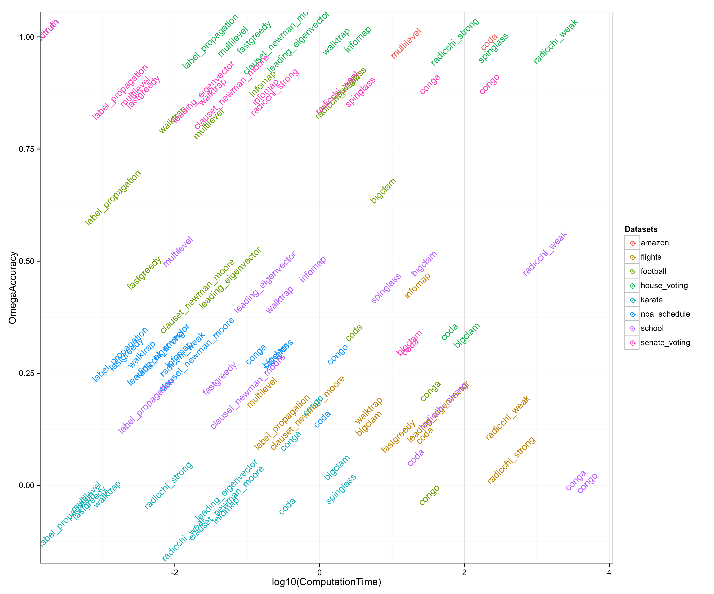
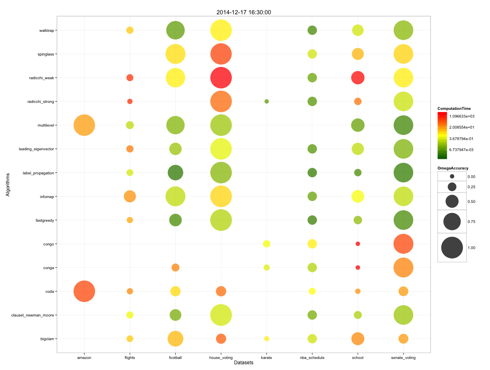
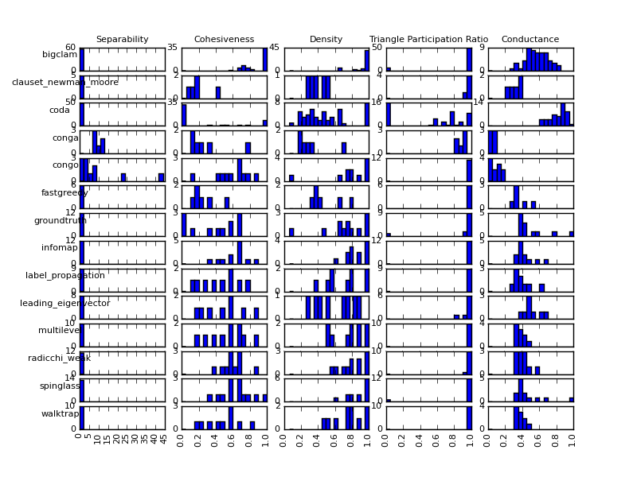
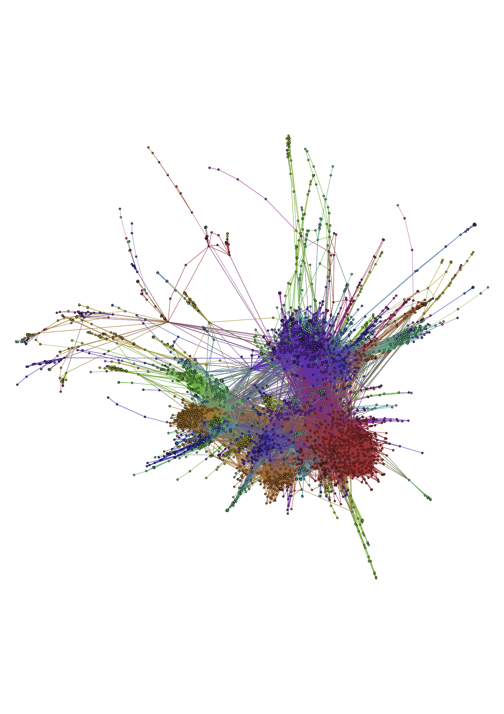

The experiments are listed below:


#### Ground Truth Similarity Test
- File: __metrics_clustering.py__
- Goal: Determine if metrics applied to communities from Ground Truth are simialr when grouped with metrics of non Ground Truth communities. The experiemnt leverages kmeans clustering where the features are the metrics, and the observations are a set of features for a given community.
- __RUN__: python experiments/metrics_clustering.py metrics_dir dataset_name
- __RESULTS__:

#### Time vs Accuracy (two approaches)
- File: __metricsCharts.R__
- Function: plotRunOmega
- Goal: For a given data set with Ground Truth, measure how the result accuracy changes with certain algorithms, specifically taking into consideration executation time (time complexity)
- __RUN__: metrics <- getMetrics("/path/to/json/metrics", "dataset name (i.e. football)")
-          plotRunOmega(metrics)
- __RESULTS__: This example shows the log of the calculation time vs. omega score for all the datsets in the Lab41/Circulo-Data Results 2 release



- File: __metricsCharts.R__
- Function: plotMetrics
- Goal: Compare results computation time and accuracy across datasets
- __RUN__: metrics <- getMetrics("/path/to/json/metrics", "dataset name (i.e. football)")
-          plotMetrics(metrics)
- __RESULTS__: This exmple shows the datasets vs algorithms. The size of the bubble represents Omega score and the color represents how long it took to compute that result



#### Comparing algorithm results using Omega score
- File: __run_comparison.py__
- Goal: Creates csv files that use omega score to create a matrix of distances between the various results sets. Ground truth is treated as just another algorithm
- __RUN__: python3 run_comparison.py <Path to results json files> <output path for csv files> 
- __RESULTS__: This produces a csv file with relative distances between algorithm results

#### Cluster Results of run_comparison.py
- File: __cluster_omega_comparison.py__
- Goal: Take results of run_comparison.py (distance matrix between the algorithm results) and cluster results to find similar algorithms
- __RUN__: python3 cluster_omega_comparison.py <path to csv file(s)> [--n <number of clusters desired>]
- __RESULTS__: A list of how often each pair of algorithms appears in the same cluster is produced. A few lines of the result are provided below:
``` 
5
multilevel--spinglass 5
infomap--spinglass 5
leading_eigenvector--walktrap
 5
leading_eigenvector--multilevel 6
multilevel--walktrap
 6
clauset_newman_moore--fastgreedy 7
```

#### Histogram metrics across datasets
- File: __histogram_metrics.py__:
- Goal: This script allows you to compare the result of metrics across algorithms for a single dataset. It creates a histogram for each metric/algorithm pair showing the number of communities for that metric that fall into the specified bin. 
- __RUN__: python3 histogram_metrics.py <folder of your metrics json file> <Dataset desired i.e. amazon> [Optional: --metrics Density,Cohesiveness]
- __RESULTS__: This example shows the distributions of five parameters across datasets for the football data



#### Combine results into single graphml file
- File: __create_graphml.py__
- Goal: Create a single graphml file that contains the results off the community detection algorithms as attributes on each vertex. This is useful for visualizing results in Gephi manually or running the java code in this directory to plot them automatically
- __RUN__: python3 create_graphml.py <path to results json files> <Path to graphs, typically circulo/circulo/data/GRAPHS> <output directory for new graphml files> [--least]
-   The --least option causes the "community" stated for a node to be the smallest community (# of nodes) the node is a part of. This is useful for plotting in Gephi
- __RESULTS__: Graphml files that have attritubes for each algorithm that describe which community they were placed in.

#### Plot Community Detection 
- Folder: __gephi_plot__
- Goal: The graphml file created by create_graphml.py makes it easy to view the datset in Gephi and explore the graph. This Java program creates static PDFs of the results from the various aglorithms using Gephi as a layout and plotting engine
- __COMPILE__: Use Maven to compile the project. mvn compile assembly:single will give you a jar that contains all the dependcies needed to run the executable
- __RUN__: java -jar gephi_plot-0.0.1-SNAPSHOT-jar-with-dependencies.jar <Directory with graphml files or graphml file> <output dir (it won't create a folder for you)>
- __RESULTS__: A set of PDFs are produced using the community detection results to color a visualization of the underlying graph that has been layed out using force-directed layout (Gephi's Force-Atlas 2). This plot is the flights data colored using the Infomap community detection results:




